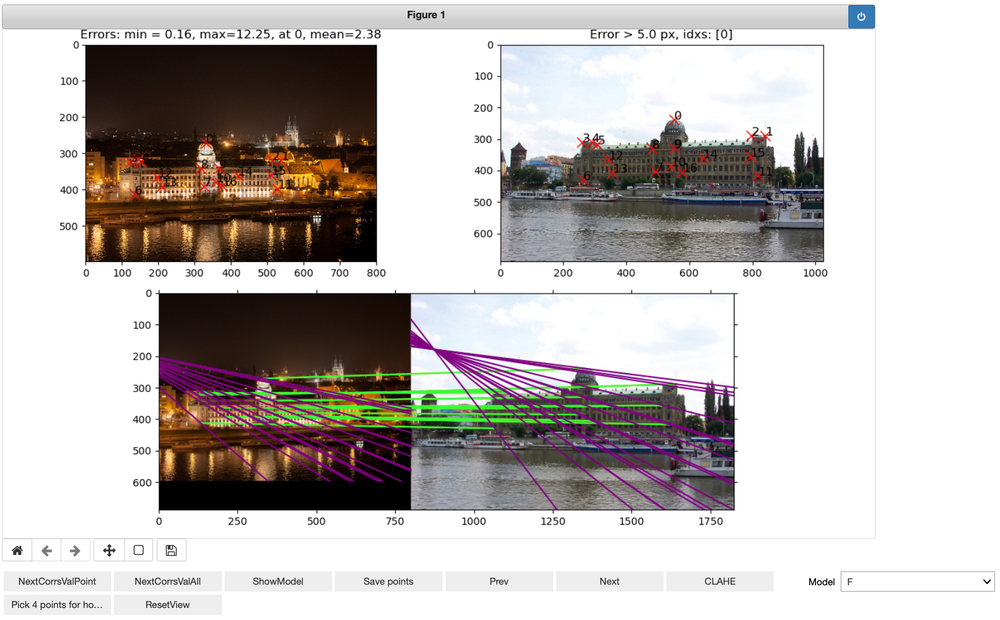
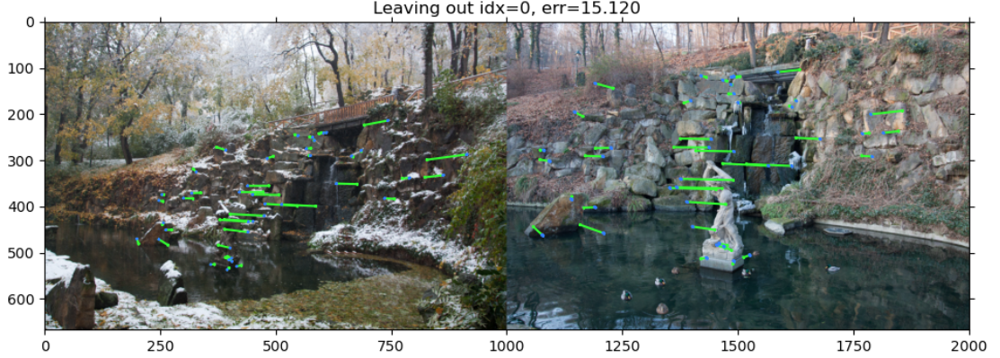
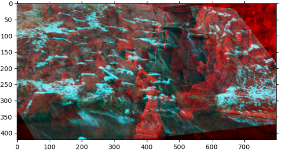
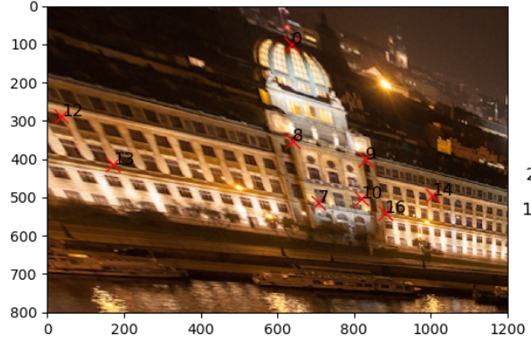

# pyxelstitch
> Simple, matplotlib based tool for hand-labeling the two-image correspondences


## Install

`pip install pixelstitch`

## How to use

Let's test our annotator on a sample project. It needs a list of triplets: (`path_to_img1`, `path_to_img2`, `path_to_corrs_to_save`).

```python
import os
rootdir = 'sample_project'
pairs = os.listdir(rootdir)
img_pairs_list = []
for p in pairs:
    if p == '.DS_Store':
        continue
    cur_dir = os.path.join(rootdir, p)
    img_pairs_list.append((os.path.join(cur_dir, '01.png'),
                           os.path.join(cur_dir, '02.png'),
                           os.path.join(cur_dir, 'corrs.txt')))

print (img_pairs_list)
```

    [('sample_project/ministry/01.png', 'sample_project/ministry/02.png', 'sample_project/ministry/corrs.txt'), ('sample_project/petrzin/01.png', 'sample_project/petrzin/02.png', 'sample_project/petrzin/corrs.txt')]


    /opt/homebrew/Caskroom/miniforge/base/envs/python39/lib/python3.9/site-packages/ipykernel/ipkernel.py:283: DeprecationWarning: `should_run_async` will not call `transform_cell` automatically in the future. Please pass the result to `transformed_cell` argument and any exception that happen during thetransform in `preprocessing_exc_tuple` in IPython 7.17 and above.
      and should_run_async(code)


Now we are ready to initialize `CorrespondenceAnnotator`. Don't forget to declare magic command ```%matplotlib widget```.
**WITHOUT MAGIC IT WOULD NOT WORK**

You also should explicitly specify, if you want to save (and possibly over-write previous better annotation) current correspondences automatically when clicking on **prev** and **next** buttons for going to the next pair. 

```python
%matplotlib widget
from pixelstitch.core import *
CA = CorrespondenceAnnotator(img_pairs_list, save_on_next=True)
```

    /opt/homebrew/Caskroom/miniforge/base/envs/python39/lib/python3.9/site-packages/ipykernel/ipkernel.py:283: DeprecationWarning: `should_run_async` will not call `transform_cell` automatically in the future. Please pass the result to `transformed_cell` argument and any exception that happen during thetransform in `preprocessing_exc_tuple` in IPython 7.17 and above.
      and should_run_async(code)


Now we can run the annotation. 

**Left-click** on the image to add a point 

**right-click** -- to remove the point from both images. 

### Matplotlib shortcuts:

- **o** for zoom 
- **p** for pan (move)

It is also recommended to set full page width for the jupyter


```python
%matplotlib widget
from IPython.core.display import display, HTML
display(HTML("<style>.container { width:95% !important; }</style>"))
CA.start(figsize=(12,7))
```



# Controls

## Selectors

- `Model`. One can select between "`F`" -- fundamental matrix and "`H`" -- homography. The selection influences the reprojection error type, and the visualization of the models and reprojection errors, shown when clicked on `NextCorrsValPoint`,  `NextCorrsValAll` and  `ShowModel` buttons.

## Buttons

- `NextCorrsValPoint`. Shows the correspondence in the bottom axis. The image title shows correspondence index and the reprojection error. If `Model` is `F`, it will show induced epipolar line, if `H` -- the position of the reprojected point from other image. The model is estimated with all other correspondences except current one. 

- `NextCorrsValAll`. Shows the correspondences in the bottom axis. Similar to `NextCorrsValPoint` button, but shows all points. The model is estimated with all  correspondences except current one, which index is shown in the title. 



- `ShowModel`. Has different behavoir depending on the `Model` selected. For `F` -- shows correspondences with their induced epipolar lines. Unlike `NextCorrsValPoint` and `NextCorrsValPoint` all correspondences are used for model estimation. 


- For `H`, the button shows overlay of image 1 reprojected into image2 with image2. The reprojected area is defined by the convex hull of the labelled correspondences. Next click flips the order, i.e. shows the image 2 reprojected into image 1.


- `Save points` -- saves (overwrites) the correspondences into the text file.

- `Prev` -- Loads and shows previous image pair to label. If the `CorrespondenceAnnotator` was initialized with `save_on_next=True`, the current pair correspondences are saved before the switch. Change is not cyclical, so the button does nothing on 1st image pair

- `Next` -- Loads and shows next image pair to label. If the `CorrespondenceAnnotator` was initialized with `save_on_next=True`, the current pair correspondences are saved before the switch.Change is not cyclical, so the button does nothing on last image pair.

- `CLAHE` -- Images are shown with enhanced contrast with [CLAHE](http://amroamroamro.github.io/mexopencv/opencv/clahe_demo_gui.html) algorithm.


- `Pick 4 points for homography` -- Special mode. User picks 4 points in one image, which define new fronto-parallel view. This mode helps for labeling obscure views, see example below. The order of the points: top-left -> top-right -> bottom right -> bottom left. After the 4 point picked, the mode is switched off, so user needs to click the button again if she wants to rectify another image.

- `ResetView` -- Resets any recifications or zoom done to images.


### Rectification picking mode example

3 points are selected


All points are selected and image1 is rectified to the rectangle, defined by the selected points

